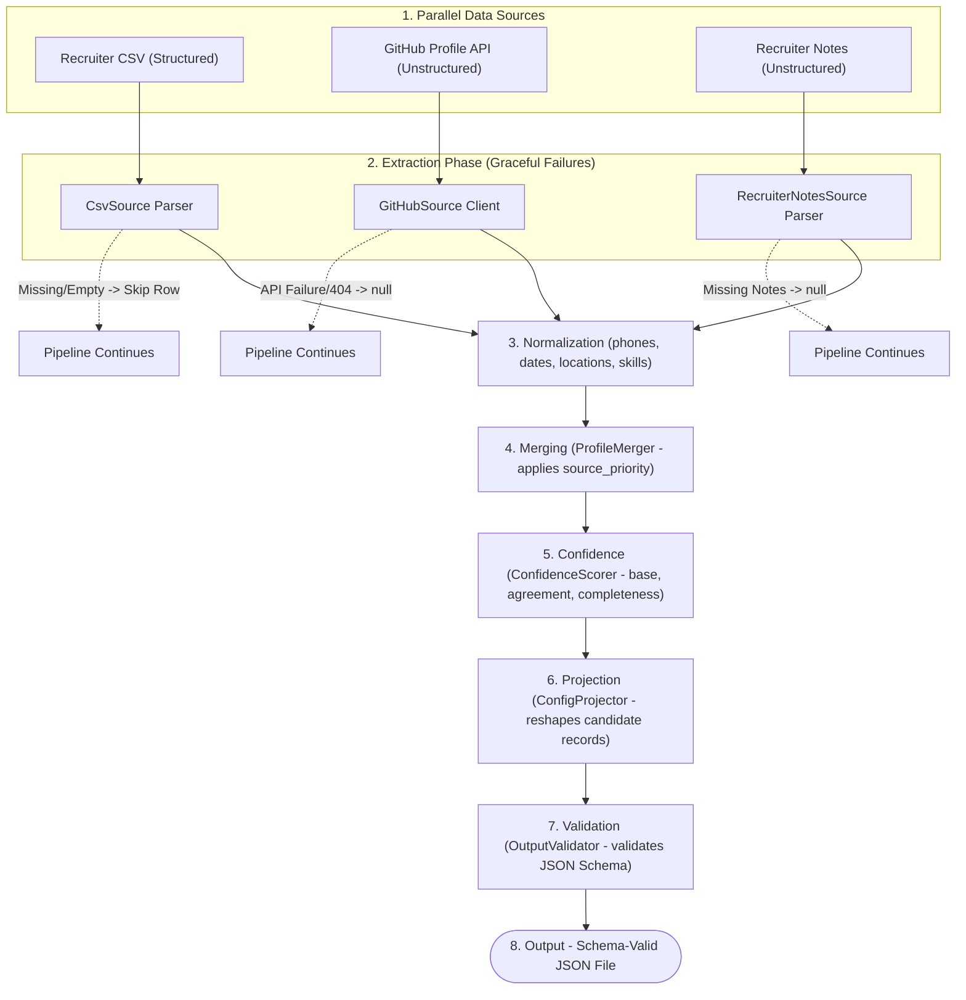

# Multi-Source Candidate Data Transformer

A CLI application that ingests, normalizes, merges, and projects candidate data from structured CSV logs, unstructured GitHub API endpoints, and unstructured Recruiter Notes.

## Tech Stack
- **Java 17** (records, switch expressions, HttpClient)
- **Maven** (dependency management & shade packaging)
- **Jackson** (JSON serialization & tree traversal)
- **Apache Commons CSV** (RFC 4180 CSV parsing)
- **Google libphonenumber** (E.164 phone validation)
- **networknt json-schema-validator** (Dynamic schema checks)
- **picocli** (Robust CLI flag parsing)

---

## Data Pipeline Flow
The following flowchart illustrates the parallel data ingestion, normalization, conflict resolution, confidence scoring, projection, and schema-valid JSON generation steps of the pipeline.



---

## Getting Started

### Prerequisites
- Java 17 or higher
- Maven 3.6+

### How to Build
Run the following command in the project root to compile the sources, execute unit tests, and build an executable "fat" JAR:
```bash
mvn clean package
```
This builds the package under `target/transformer-1.0.jar`.

### CLI Command Structure
```bash
java -jar target/transformer-1.0.jar \
  --csv <path_to_recruiter_csv> \
  [--github <github_username>] \
  [--notes <path_to_recruiter_notes_txt>] \
  --config <path_to_config_json> \
  --output <path_to_output_json>
```

### How to Run

> [!NOTE]
> Each run command below is configured with a distinct, descriptive output filename (e.g., `output_default.json`, `output_custom.json`, and `output_three_source.json`) on purpose. Running these commands sequentially allows all three generated results to persist side by side on disk for comparison, rather than overwriting one another.

#### 1. Run with Default Schema
Projects the canonical candidate structure to `output_default.json`:
```bash
java -jar target/transformer-1.0.jar --csv sample_inputs/recruiters.csv --github octocat --config config/default.json --output output_default.json
```

#### 2. Run with Custom Projection Schema
Projects fields wrapping confidence and provenance metrics to `output_custom.json`:
```bash
java -jar target/transformer-1.0.jar --csv sample_inputs/recruiters.csv --github octocat --config config/custom.json --output output_custom.json
```

#### 3. Run with All Three Sources (CSV + GitHub + Recruiter Notes)
Ingests and merges CSV, GitHub API profiles, and Recruiter Notes, outputting to `output_three_source.json`:
```bash
java -jar target/transformer-1.0.jar --csv sample_inputs/recruiters.csv --github octocat --notes sample_inputs/recruiter_notes/john_doe_notes.txt --config config/default.json --output output_three_source.json
```

---

## Automated Test Suite

The test suite in [PipelineTest.java](src/test/java/com/eightfold/PipelineTest.java) contains exactly **10 automated tests** targeting ingestion, merging, normalization, schemas, and conflict resolution across multiple sources.

| Test Method | Scenario Setup | What It Proves / Asserts |
| :--- | :--- | :--- |
| `testHappyPath` | Ingests a CSV candidate and fetches matching GitHub profile for `johndoe` (names match, bio/headline differs). | Asserts E.164 phone formatting (`+14155552671`), Location normalization (city/country), and that the higher-priority CSV headline overrides the GitHub bio (setting headline to "Software Engineer" with `0.47` confidence, and name confidence to `0.91` due to agreement). |
| `testMissingGitHubSource` | Ingests a CSV candidate but simulates a GitHub API fetch failure (returns `null` for the candidate). | Asserts the pipeline continues gracefully without crashing, falling back entirely to CSV data with structured single-source name confidence (`0.7`) and missing fields resolving to `null` with `0.0` confidence. |
| `testMalformedCsvRow` | Ingests a CSV file containing one malformed row (missing email) and one valid row. | Asserts the pipeline logs a warning, skips the malformed candidate, and successfully parses only the valid candidate. |
| `testConflictResolution` | Ingests CSV and mock GitHub profiles with conflicting names ("CSV Name" vs "GitHub Name"). | Asserts that the CSV value is chosen due to higher priority, the name confidence is downgraded to `0.42` due to the conflict, and the provenance tracks both the winning value and the conflicted overridden value. |
| `testCustomProjection` | Ingests a candidate and projects it using a custom OutputConfig representing custom JSON mappings and metadata wrappers. | Asserts that candidate fields are correctly projected to custom target keys (e.g. `emails[0]` to `primary_email`), wrapped with correct confidence/provenance, and validated successfully against the schema validator. |
| `testMergeGenericEngine` | Directly merges 3 sourced profiles (Source A: Structured P1, Source B: Unstructured P2, Source C: Structured P3) for Alice Smith. | Asserts that the merge engine is fully source-count-agnostic, resolving name agreement to `0.91`, selecting the highest-priority headline ("Eng Manager") with `0.42` confidence, and logging zero-source provenance for empty fields. |
| `testRecruiterNotesExtraction` | Ingests plain-text recruiter notes using the Recruiter Notes parser. | Asserts regex and keyword scanning successfully extracts years of experience (`10`), location city (`New York City`), headline (`Technical Lead`, stripping leading "a"/"an" articles), and observed skills (`java`, `python`, `sql`) with notes provenance. |
| `testThreeSourceMergeEndToEnd` | Executes the end-to-end pipeline using all three sources (CSV + Mock GitHub + Notes) for John Doe. | Asserts that the three-source run boosts name confidence to `0.91` (due to agreement), resolves CSV Software Engineer headline priority, maps location city from Notes, and derives `years_experience: 10` by resolving it from the notes. |
| `testRecruiterNotesProvenanceMethod` | Merges a candidate profile where location and skills are only populated by Recruiter Notes. | Asserts that the resolved field provenance correctly records the source as `"Recruiter Notes"` and uses the precise originating methods: `"Regex Extraction"` for location and `"Keyword Scan"` for skills. |
| `testThreeSourceSymmetricProvenance` | Performs a mock merge of all three sources, each contributing a different field (CSV contributes email, GitHub contributes headline/skills, Notes contributes experience/location). | Asserts that every resolved field in the final candidate profile retains the exact originating provenance method of its contributing source (e.g. CSV Ingestion, GitHub API Fetch, Regex Extraction) rather than falling back to hardcoded defaults. |

To run the full test suite, execute:
```bash
mvn test
```

---

## Key Assumptions & Heuristics
- **Phone Number Parsing**: Defaults to the US (`US`) region context for parsing phone numbers if the country code is missing or ambiguous.
- **Location Parsing**: Split by commas in a best-effort manner. Recognizes standard US state abbreviations (e.g. `CA` -> country: `US`, region: `CA`) and country keywords (e.g. `india` -> `IN`, `united kingdom` -> `GB`). Unknown country/region suffixes fallback to storing the entire raw string in `city`.
- **Merge Logic Fallback**: The primary matching key is a candidate's normalized lowercase email. Because public GitHub profiles may omit email addresses, a case-insensitive fallback on the candidate's name is used to enable successful profile enrichment during CLI execution.
- **GitHub Failures**: When the GitHub API triggers a rate limit (403), returns a 404, or times out, the tool continues gracefully without crashing, populating fields with fallback values and logging details.
- **Date Normalization**: Date normalization is implemented but not exercised by the chosen sources (CSV lacks experience dates, GitHub has no experience timeline). It is fully functional and ready for ATS JSON or resume inputs.
- **Recruiter Notes Extraction**: Uses conservative, explainable regular expression matching for headlines, locations, and years of experience, alongside boundary-safe keyword matching for skills. No matches fallback to `null` to ensure only high-confidence extractions are merged.

---

## Configuration-Driven Merge Priority
You can adjust conflict resolution priority by modifying the `"source_priority"` array in the output configuration JSON file (e.g. [config/default.json](config/default.json)):
```json
"source_priority": [
  "Recruiter CSV",
  "GitHub Profile API",
  "Recruiter Notes"
]
```
If a candidate has values present in multiple sources, the merge engine selects the value from the highest-priority source. If `"source_priority"` is omitted, it defaults to `["Recruiter CSV", "GitHub Profile API", "Recruiter Notes"]`.

---

## Confidence Scoring Formula
Field-level confidence is calculated deterministically via `ConfidenceScorer.java`:
$$\text{Confidence} = \text{Base Confidence} \times \text{Agreement Multiplier} + \text{Completeness Bonus}$$
- **Base Confidence**: 
  - Structured sources containing `"CSV"` or `"structured"` default to `0.7`.
  - Unstructured sources containing `"GitHub"` or `"API"` default to `0.5`.
- **Agreement Multiplier**:
  - Boosted to `1.3` if all contributing sources agree on the value (capped at a final score of `1.0`).
  - Reduced to `0.6` if there is a value conflict (where the winner is picked based on configuration priority).
  - Kept at `1.0` if there is only a single source for that field.
- **Completeness Bonus**:
  - `+0.05` bonus if the field holds rich content (list size > 1, or string length > 15).
  - `-0.05` penalty if the resolved string has a length < 3.

---

## Known Limitations
- **Years of Experience**: The recruiter CSV lacks dates and the GitHub public profile API does not supply employment timelines. While the pipeline can extract `years_experience` from Recruiter Notes when provided, it falls back to `null` with a traceable provenance entry when notes are missing and no timeline-rich inputs (like resume parsers or ATS JSONs) are integrated.
- **Education background**: The recruiter CSV, GitHub profile API, and Recruiter Notes do not provide educational records. Consequently, `education` returns empty and is tracked in the provenance log as `no source had this field`.

---

## Out of Scope
- **Scraping LinkedIN**: Requires web scraping or authenticated APIs which are out of scope.
- **Resume PDF Extraction**: Out of scope for this plain-text JSON/CSV workflow.
- **Authentication/OAuth**: Uses only unauthenticated requests to public API endpoints.

---

## Video Demo: 
https://youtu.be/zvY3_xzcfRE